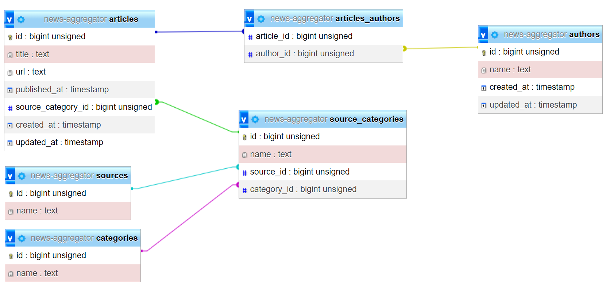

## To Run The Project
- Run the server: ```php artisan serve```
  - This is just for development, we must run a web server to run this project
- Run the scheduler to create new aggregation jobs every hour: ```php artisan schedule:work```
  - This solution is just for testing, the correct procedure is to create a cron job on the OS: [Documentation](https://laravel.com/docs/10.x/scheduling#running-the-scheduler)
- Run the queue worker to execute the jobs from the database: ```php artisan queue:work```
  - To run the queue worker in a docker container and ensuring that it stays open we use ```supervisor```: [Documentation](https://laravel.com/docs/10.x/queues#supervisor-configuration)

## General Procedure
- Scheduler (```./app/Console/Kernel.php```) runs hourly and creates new jobs to gather data from the news sources
  - Jobs are created in the database
- Then the queue worker, looks for jobs in the database and tries to execute them in the background
  - Jobs are defined in: ```./app/Jobs/*```
  - Each Job corresponds to a single data source
  - Each Job utilizes our custom Aggregator classes to execute the logic of the execution: ```./app/Aggregators/*```
- We access the local data on the main thread of the application through the Request/Response flow

## Data Structure
- While entering new articles to the database, we try to find the author. If it didn't exist, we create the author in the db
- Due to having different sources, we have 7 local Categories
- Because each Source has a different set of categories, we created a mapping schema in the ```./database/seeders/SourceCategorySeeder.php``` that maps each local Category to a list of categories that exist on each Source
- If a Source doesn't provide the Authors' name, we use the value ```Unknown```
- A view of the database tables:

- Articles and Authors have a many-to-many relationship through ```articles_authors``` pivot table
- Each record in the ```source_categories``` is a third-party category on the source api
- Each ```source_categories``` records has one Source and one Category
- An article belongs to one Category through its SourceCategory
- An article belongs to one Source through its SourceCategory
